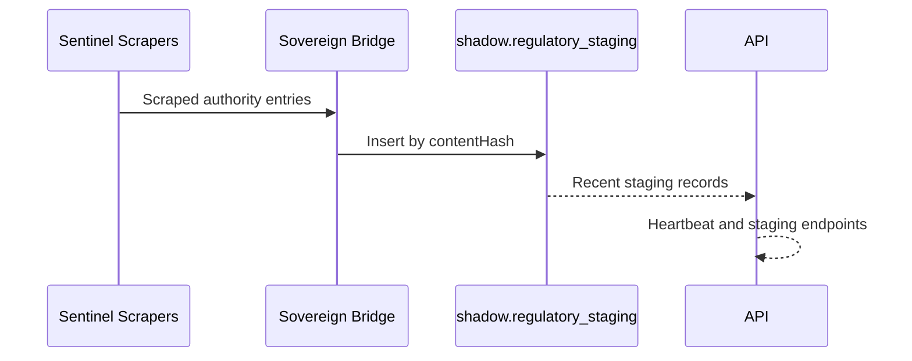
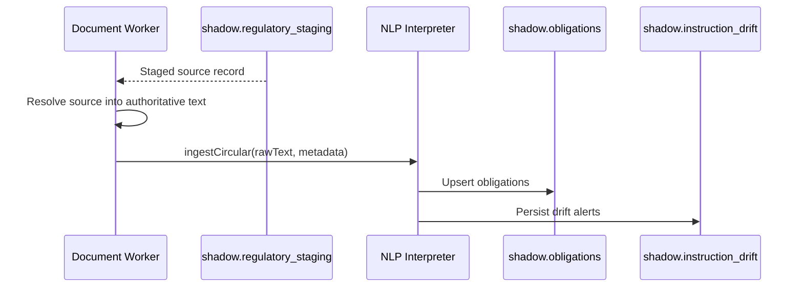
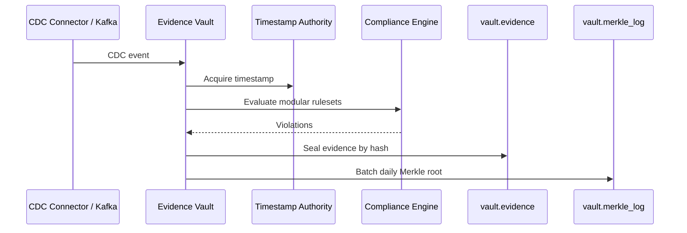
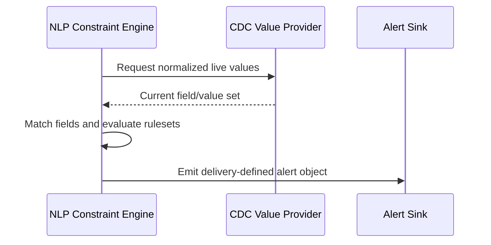
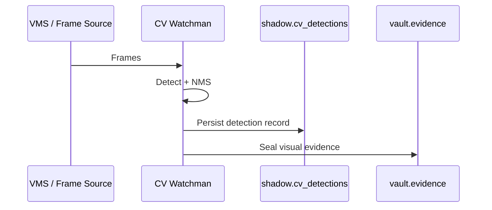

# SAQR Phase 1 Execution Sequences and Handling

Date: 2026-04-07
Scope: `P1-404`

## Objective

Define the production-ready handling model for regulatory ingestion, evidence sealing, and rule execution so the delivery team can wire the missing environment pieces without ambiguity.

## Completed Result

`P1-404` is now complete.

## Blunt Status

SAQR does not have one single end-to-end production pipeline today. It has:

- one implemented staging pipeline for regulatory-source capture
- one implemented CDC-to-evidence pipeline
- one implemented visual-detection-to-evidence pipeline
- one interface-ready but not yet delivery-wired regulatory-text ingestion path
- one interface-ready but not yet delivery-wired NLP constraint-to-live-CDC alerting path

That is the honest Phase 1 execution status.

## Primary Artifact

Machine-readable sequence spec:

- `docs/contracts/saqr-execution-sequences.yaml`

This is the delivery-team source of truth for:

- sequence IDs
- preconditions
- actors
- idempotency rules
- failure handling
- observability checkpoints
- explicit delivery-team responsibilities

## Sequence Matrix

| Sequence ID | Area | Current Status | Meaning |
|---|---|---|---|
| `REG-INGEST-01` | Sentinel scrape to staging | Implemented | Regulatory-source changes are captured and staged today. |
| `REG-INGEST-02` | Staging row to NLP ingestion | Interface-ready, delivery wiring required | The repo exposes `ingestCircular`, but the document-acquisition worker is not wired here. |
| `RULE-EXEC-01` | CDC compliance evaluation | Implemented | CDC events are evaluated through modular Evidence Vault rulesets today. |
| `RULE-EXEC-02` | NLP constraint-to-CDC comparison | Interface-ready, delivery wiring required | The engine exists, but a real CDC-value provider and durable alert sink are not wired here. |
| `EVID-SEAL-01` | CDC evidence sealing and Merkle batching | Implemented | Violations are sealed and batched today. |
| `EVID-SEAL-02` | Visual evidence sealing | Implemented | CV detections are persisted and sealed today. |

## Execution Sequences

### REG-INGEST-01

Production-ready rule:

- `contentHash` is the staging dedupe key
- staging success is visible through the source heartbeat and recent-staging endpoints
- source-collection failures are recoverable and should retry on the next scheduled session

### REG-INGEST-02

Production-ready rule:

- the worker must use `authority + contentHash` as the document-revision identity
- the worker must not mark a staged document completed until NLP persistence succeeds
- this worker is not implemented in the repo and must be supplied by the delivery team

### RULE-EXEC-01 and EVID-SEAL-01

Production-ready rule:

- CDC event sealing is authoritative only after both timestamp acquisition and evidence hashing are complete
- evidence dedupe is keyed by the canonical `sha256_hash`
- Merkle batching is additive and must not rewrite prior batches
- before production cutover, the delivery team must add explicit retry/DLQ handling for CDC processing failures instead of relying only on logging

### RULE-EXEC-02

Production-ready rule:

- alert dedupe should be based on `authority + ruleId + field + regulatoryValue + contentHash`
- unmatched fields are not hard failures; they are mapping gaps
- the real value provider and durable alert sink are not implemented in this repo and remain delivery responsibilities

### EVID-SEAL-02

Production-ready rule:

- visual evidence is canonicalized before persistence
- per-detection persistence failures should be logged without terminating the entire scan cycle
- delivery must still provide the real VMS environment and persistence infrastructure

## Failure and Idempotency Rules

### Regulatory ingestion

- Staging dedupe key: `contentHash`
- A staging failure is recoverable if caused by fetch/browser/source-structure instability
- A staging failure is terminal if required DB connectivity is unavailable at startup

### NLP ingestion

- Recommended document revision key: `authority + contentHash`
- Retryable failures: document fetch timeout, transient parser failure, temporary DB unavailability
- Terminal failures: unreadable source format without provider implementation

### CDC evidence path

- Evidence dedupe key: canonical `sha256_hash`
- Current repo behavior logs processing failures
- Production-ready delivery requirement: add retry or DLQ behavior before cutover

### Visual evidence path

- Detection persistence must remain best-effort per detection
- A single failed detection write must not drop the entire scan cycle

## Delivery-Team Handshake

The delivery team must wire these missing pieces in Phase 1 execution:

1. A document-acquisition/orchestration worker for `REG-INGEST-02`
2. A real CDC-value provider and alert sink for `RULE-EXEC-02`
3. Retry/DLQ semantics for CDC processing failures
4. Real DB, Kafka, VMS, and source environments while preserving the existing demo environment

## Verification

This phase is a specification and execution-definition phase.

Artifacts created/updated:

- `docs/contracts/saqr-execution-sequences.yaml`
- `docs/SAQR_Phase1_Execution_Sequences_and_Handling.md`
- `docs/contracts/saqr-service-contracts.md`

No UI files were changed in this phase.
