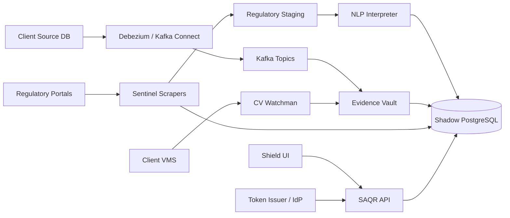

# SAQR Phase 1 Architecture Overview

Date: 2026-04-07
Scope: Phase 1 production-ready topology

## Purpose

This document gives the delivery team the shortest accurate view of how the production-ready SAQR package is structured after Phase 1 hardening.

## System Intent

SAQR is a read-only compliance interception platform. It observes regulatory and operational data, evaluates that data against codified obligations, preserves evidence, and serves that evidence through the SAQR API and Shield UI.

Golden constraint:

- SAQR does not write back to client source systems.

## Runtime Modes

- `demo`: keeps the current client-demo environment intact, allows demo data and simulated paths.
- `production-ready`: disables demo-only execution paths, enforces stronger config validation, and exposes delivery-team seams for real infrastructure wiring.

## Production-Ready Topology

## Core Service Roles

- `apps/shield-ui`: frozen Phase 1 interface shell. Visual design remains unchanged.
- `apps/api`: authenticated read API for dashboard, evidence, references, and runtime visibility.
- `services/evidence-vault`: CDC event processing, compliance rule evaluation, evidence sealing, and Merkle batch generation.
- `services/sentinel-scrapers`: regulatory source collection and staging ingestion.
- `services/nlp-interpreter`: circular parsing, obligation extraction, and drift detection.
- `services/cv-watchman`: VMS frame polling, detection flow, and evidence creation for visual compliance.
- `services/cdc-connector`: Debezium connector artifacts for delivery-team wiring.

## Shared Phase 1 Patterns

- Runtime enforcement is centralized through `shared/runtime-profile.js`.
- Config validation and placeholder rejection are centralized through `shared/service-config.js`.
- Observability is centralized through `shared/observability.js`.
- Provider and rule boundaries are explicit so delivery can swap infrastructure implementations without rewriting core logic.

## Delivery-Team Seams

The following remain intentionally external to this repository:

- shadow PostgreSQL runtime
- Kafka and Kafka Connect / Debezium runtime
- VMS endpoints and credentials
- token issuer / identity integration
- ingress, DNS, TLS, and cluster security controls

## Phase 1 Boundaries

- The UI is preserved and frozen.
- Core intelligence is interface-ready and test-backed, but some domain sophistication remains Phase 2 or delivery-wired work.
- Deployment packaging is ready for handoff, not a substitute for client environment provisioning.

