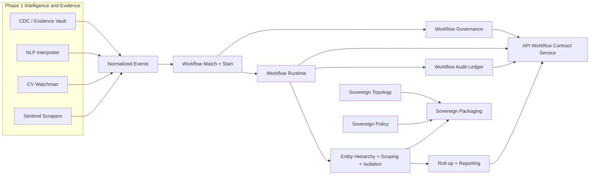

# SAQR Phase 2 Architecture Overview

Date: 2026-04-08
Scope: Phase 2 backend architecture and delivery seams

## Purpose

This document gives the delivery team the shortest accurate view of how the Phase 2 architecture now sits on top of the Phase 1 production-ready package.

## System Intent

Phase 2 turns SAQR from a fixed compliance interception package into a configurable operating model for:

- workflow-driven triage, approvals, SLAs, escalations, and audit history
- multi-entity scope resolution and reporting
- sovereign topology, policy, and rollout packaging

Golden constraints that still apply:

- SAQR does not write back to client source systems.
- UI/UX remains frozen unless separately approved.
- The current demo environment remains intact.

## Phase 2 Topology

## Architecture Truth

One implementation truth matters more than anything else for delivery:

- the workflow engine is currently an embedded backend module, not a standalone network service

That is deliberate. The current repo implements deterministic workflow runtime, governance, and audit behavior in-process so delivery can wire persistence and HTTP exposure later without rewriting core logic.

## Core Phase 2 Building Blocks

### Workflow Layer

- `services/workflow-engine/src/runtime-core.js`: deterministic workflow execution runtime
- `services/workflow-engine/src/governance.js`: draft, publish, rollback, and change-history controls
- `services/workflow-engine/src/audit-ledger.js`: combined runtime and governance audit projection
- `services/workflow-engine/src/actor-directory.js`: provider-driven actor and assignment resolution
- `apps/api/src/workflow-contract-service.js`: API-side delivery seam for runtime, governance, and audit views

### Multi-Entity Layer

- `shared/entity-hierarchy.js`: canonical hierarchy and lineage model
- `shared/entity-scoping.js`: principal grants and lineage-aware scope access
- `shared/entity-isolation.js`: runtime partition and cross-entity boundary model
- `shared/entity-rollup.js`: inherited control aggregation
- `shared/entity-reporting.js`: executive and portfolio reporting generation

### Sovereign Layer

- `shared/sovereign-topology.js`: supported rollout patterns
- `shared/sovereign-policy.js`: residency, encryption boundary, and cross-border movement rules
- `shared/sovereign-packaging.js`: compose, env, and k8s packaging profiles for delivery rollout

## Delivery-Team Seams

The following remain intentionally delivery-owned or client-environment-owned:

- durable storage for workflow definitions, instances, and audit history
- live identity and directory resolution behind the actor-directory interface
- notification dispatch, tasking, and approval-channel integration
- live HTTP route mounting and external API exposure for workflow operations
- tenant or client-specific infrastructure values inside sovereign overlays

## Design Position After P2-303

- Workflow behavior is no longer only a planning concept. It is contract-defined, executable, and acceptance-tested.
- Multi-entity behavior is explicit and test-backed, not inferred from UI session state.
- Sovereign rollout packaging is modeled concretely enough for delivery to start from a defined profile instead of inventing one.
- Phase 2 is still backend-first. It does not claim approved UI workflow administration screens.

## Boundaries

This architecture document does not claim:

- final client-specific infrastructure
- final persistence schema for workflow runtime storage
- final authz implementation against a live IdP
- final UI exposure of workflow and entity administration

Those remain delivery and later handoff concerns, not repo-truth claims.
